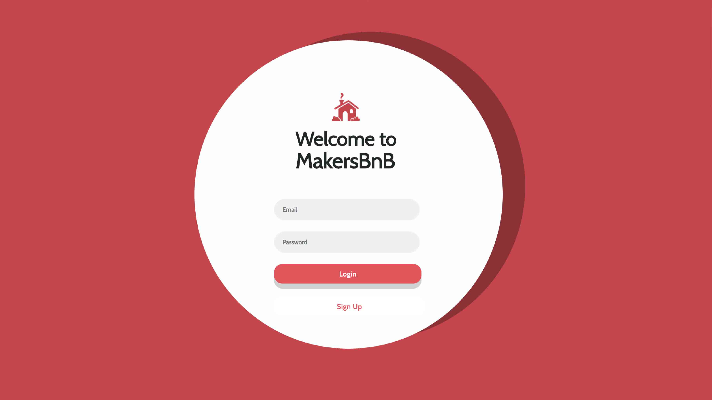
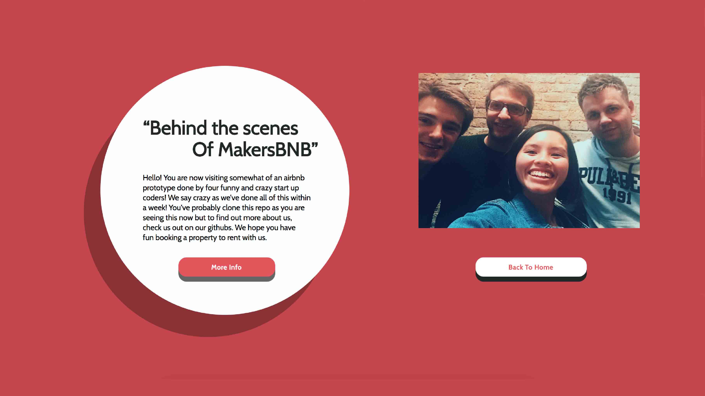

AIRBNB Challenge:
===============



The challenge is to recreate as much of AIRBNB as possible within a week. Great fun.

MVP:  
======

```
As a user,
When I'm looking on this MakersBNB,
I would like to view rentals on the home page

As a user,
When I'm looking on this MakersBNB,
I would like to search properties by city

As a user,
When I'm looking on this MakersBNB,
I would like to see the property overview that I've selected

```
We started off with listing all the AIRBNB user stories that could possibly exist from researching the workflow of how a User engages with AIRBNB. After that, we narrowed it down to three and chose the three user stories that would make our website unique

Other Accomplished User Stories:
====================

```
- User can sign in to the website 
-User can log in to the website
-User can log out from the website
-User can’t use the same username that has been installed
-User has to make sure the passwords are the same.
-User can search by city
-User can search by date
-When search, the list automatically reduces
-User can check out individual booking (Page)
-User can see the image of place, the availability, the guests, the price on the individual page 
-User can book and receives a confirmation page
-User can go back to the home page after confirmation 
-User gets to enjoy a nice interface during the experience 
```


Team:
=======



- Dania Mah (https://github.com/thatdania)
- Lewis Youl (https://github.com/LewisYoul)
- Oleg Grushetskyy (https://github.com/olegfkl)
-  Robert Clayton (https://github.com/RobertClayton)
